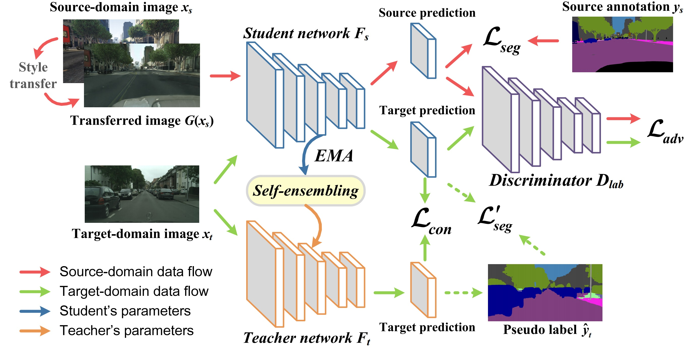
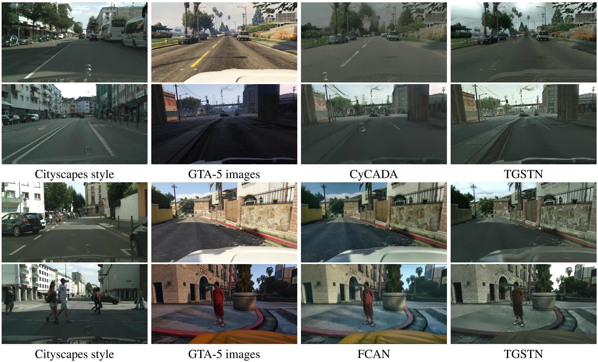

# Self-Ensembling GAN for Cross-Domain Semantic Segmentation

This is the official PyTorch implementation of the domain adaptation method in our paper [Self-Ensembling GAN for Cross-Domain Semantic Segmentation](https://arxiv.org/abs/2112.07999).



## Preparation
- Install required packages: `pip install -r requirements.txt`.
- Download the [GTA-5 Dataset](https://download.visinf.tu-darmstadt.de/data/from_games/).
- Download the [SYNTHIA-RAND-CITYSCAPES Dataset](http://synthia-dataset.net/download/808/).
  - Note: The ground-truth data in the original SYNTHIA-RAND-CITYSCAPES dataset should be adjusted to be consistent with those in the Cityscapes dataset. Here we attach the [transformed ground-truth data](https://drive.google.com/open?id=1GvdXSG4nq8Px0xYs3ate0reNNKtci2dS) for the SYNTHIA-RAND-CITYSCAPES dataset.
- Download the [Cityscapes Dataset](https://www.cityscapes-dataset.com/).
- Download the source-pretrained VGG-16 Models (for training TGSTN).
  - [VGG-16 Model (GTA-5)](https://drive.google.com/file/d/1BxzjrTZkhWFUMbH713ATDH4eb97Nxpaz/view?usp=sharing).
  - [VGG-16 Model (Synthia)](https://drive.google.com/file/d/1YCE1fEmjo67WcGhsQKVdeeArhq2LLww0/view?usp=sharing).
- Download the ImageNet-pretrained [ResNet-101 Model](https://drive.google.com/file/d/1hGjoN6w2vsTPrufJs3elJHKwYykD-6hQ/view?usp=sharing) (for training SE-GAN).

The data folder is structured as follows:
```
├── SegmentationData/
│   ├── Cityscapes/     
|   |   ├── gtFine/
|   |   ├── leftImg8bit/
│   ├── GTA5/
|   |   ├── images/
|   |   ├── labels/
│   ├── Synthia/ 
|   |   ├── images/
|   |   ├── labels/
│   └──       
└── PreTrainedModel/
│   ├── VGG_pretrained_GTA5.pth
│   ├── VGG_pretrained_Synthia.pth
│   ├── DeepLab_resnet_pretrained_init-f81d91e8.pth
...
```

## Training the Task-Guided Style Transfer Network (TGSTN) 
```
$ CUDA_VISIBLE_DEVICES=0 python TGSTN_GTA.py --restore_from /Path/To/VGG_pretrained_GTA5.pth/
```

## Style Transfer 
```
$ CUDA_VISIBLE_DEVICES=0 python StyleTrans_GTA.py --restore_from /Path/To/GTATrans.pth/
```

- Alternatively, you can download our pretrained TGSTN models for a quick look.
  - [TGSTN Model (GTA-5)](https://drive.google.com/file/d/1-m2WzC_89KyAmGQOol0kczzAeqRhOsj5/view?usp=sharing).
  - [TGSTN Model (Synthia)](https://drive.google.com/file/d/1bXgJtXe8tuIuFvSD9UjUgDYSVRvlYyNe/view?usp=sharing).

Image style transfer results from GTA-5 to CityScapes with different approaches:



## Training SE-GAN
```
$ CUDA_VISIBLE_DEVICES=0 python SEGAN_GTA.py --restore_from /Path/To/DeepLab_resnet_pretrained_init-f81d91e8.pth/
```
Alternatively, you can use the [ResNet-101 model](https://drive.google.com/file/d/1B7NMuZyxwsGSeaV9C9S0xceZKiE4DxRB/view?usp=sharing) pretrained on the GTA-5 dataset to boost the training of SE-GAN. This model is obtained by simply training with the original GTA5 samples, which yields better performance than the ImageNet-pretrained one.

## Pseudo Label Generation
```
$ CUDA_VISIBLE_DEVICES=0 python GenPseudoLabel_GTA.py --restore_from /Path/To/GTA2Cityscapes.pth/
```
- Alternatively, download our pretrained SE-GAN models for a quick look.
  - [SE-GAN Model (GTA-5)](https://drive.google.com/file/d/1bwJ4LHgPb8cdNMS2xibhVoxUNXPIRAOc/view?usp=sharing).
  - [SE-GAN Model (Synthia)](https://drive.google.com/file/d/1FV6-Y0uCDAb2JtTmCgI-4R_yFLZXHmTX/view?usp=sharing).

## Self-Training with Pseudo Labels
```
$ CUDA_VISIBLE_DEVICES=0 python SelfTrain_GTA.py --restore_from /Path/To/GTA2Cityscapes.pth/
```

## Multi-Scale Evaluation
```
$ CUDA_VISIBLE_DEVICES=0 python MultiScaleTest_GTA.py --restore_from /Path/To/Self-Trained-Model.pth/
```
- Alternatively, download our pretrained SE-GAN models for a quick look.
  - [Self-Trained-Model (GTA-5)](https://drive.google.com/file/d/1DsLrSeH6vKGITpZw_KE6xuFe9LIi_nQD/view?usp=sharing).
  - [Self-Trained-Model (Synthia)](https://drive.google.com/file/d/1WkE1vWEEnV-r3eeo6v3IoGYG37fn46rV/view?usp=sharing).

Segmentation results on real street-view video sequences from GTA-5 to Cityscapes datasets:


## Paper
[Self-Ensembling GAN for Cross-Domain Semantic Segmentation](https://arxiv.org/abs/2112.07999)

Please cite our paper if you find it useful for your research.

```
@inproceedings{SEAN,
  title={Self-ensembling GAN for cross-domain semantic segmentation},
  author={Xu, Yonghao and He, Fengxiang and Du, Bo and Tao, Dacheng and Zhang, Liangpei},
  booktitle={IEEE Trans. Multimedia},
  volume={},
  pages={},
  year={2022}
}
```

## Acknowledgement

[AdaptSegNet](https://github.com/wasidennis/AdaptSegNet)

[Fast-Neural-Style](https://github.com/abhiskk/fast-neural-style)

## License
This repo is distributed under [MIT License](https://github.com/YonghaoXu/SE-GAN/blob/main/LICENSE). The code can be used for academic purposes only.